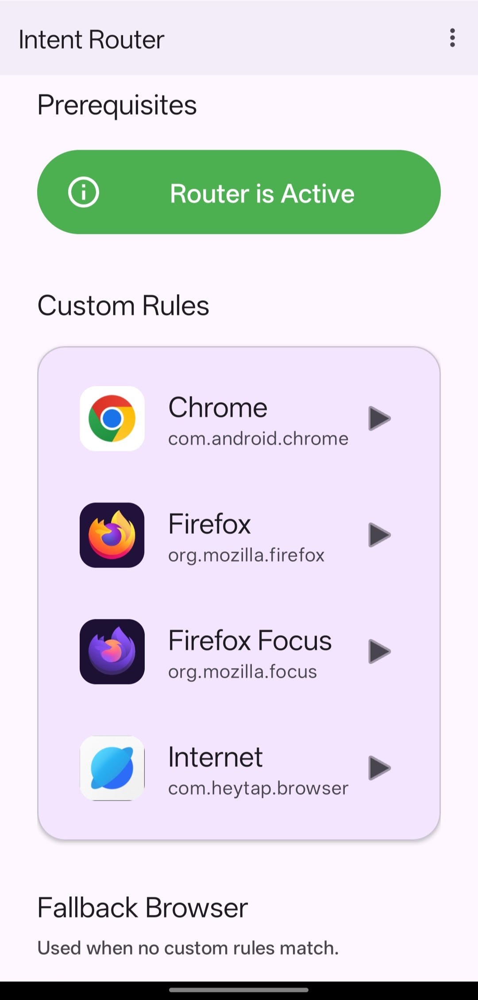

# IntentBrowserRouter

**A lightweight Android browser router** that intelligently directs links to your preferred browser based on domain patterns.



## What It Does

Set rules like:
- **reddit.com** → Open in Firefox
- **\*.github.com** → Open in Chrome
- **Any other link** → Open in your default browser
- **Incognito option** → Launch privately when needed

No ads. No tracking. Just smart routing.

## Features

✨ **Smart Routing**
- Route URLs to specific browsers using wildcard patterns
- Pattern matching anywhere: `*.example.*`, `reddit.*`, `*stream*`

🔒 **Incognito Mode**
- Launch any hostname/domain in incognito per browser

💾 **Export/Import Rules**
- Backup your routing rules as JSON
- Share configs or restore after reinstalls
- Missing browser detection warns you if a browser is uninstalled

🎨 **Clean Material UI**
- Simple, intuitive interface
- No bloat, fast performance

⚡ **Lightweight**
- Minimal dependencies
- Targets Android 5.0+ (API 21)

## Quick Start

1. **Install the app** on your Android device
2. **Open IntentBrowserRouter**
3. **Tap a browser** from the list
4. **Add rules** by tapping the + button
5. **Set your default browser** for unmatched links

## Usage Examples

| Pattern | Matches | Browser |
|---------|---------|---------|
| `github.com` | Exact domain | Chrome |
| `*.github.com` | Subdomains | Firefox |
| `reddit.*` | Any TLD (reddit.com, reddit.de) | Firefox |
| `*stream*` | Any domain with "stream" | Opera |

## Advanced Features

### Export Your Rules
Menu → Export Rules → Save JSON file

### Import Rules
Menu → Import Rules → Place JSON in app data directory

### About App Links
Some apps (like Reddit, Twitter) have verified domain links that override this router. View these in:
Android Settings → Apps → App Linking


## Building from Source

### Prerequisites
- Java 17+
- Android SDK (API 37+)
- Gradle 9.5+

### Using Android Studio (Recommended)
1. Open Android Studio
2. File → Open → select this folder
3. Wait for sync to complete
4. Build → Build Bundle(s) / APK(s) → Build APK(s)
5. APK appears in `app/build/outputs/apk/debug/` or `release/`

### Using Command Line
```bash
gradle assembleDebug      # Debug APK (unsigned, for testing)
gradle assembleRelease    # Release APK (must be signed)
```

### Signing Your APK

**Generate a keystore** (first time only):
```bash
keytool -genkey -v -keystore keystore.jks -keyalg RSA -keysize 2048 \
  -validity 10000 -alias android -keypass android -storepass android
```

**Sign the release APK:**
```bash
jarsigner -keystore keystore.jks -storepass android app/build/outputs/apk/release/app-release.apk android
```

### Installing on Device
```bash
adb install -r app/build/outputs/apk/debug/app-debug.apk
```

## Keystore Security & Updates

**IMPORTANT:** Your `keystore.jks` file signs all future APK updates. **Never lose it.**

✅ **Recommended approach:**
1. Generate keystore once (see above)
2. **Store keystore file outside your git repo** (e.g., `~/secure/keystore.jks`)
3. Reference it in build scripts or CI/CD pipelines
4. In `.gitignore`: `keystore.jks` (already added)

✅ **For future updates:**
- Use the **same keystore** to sign new APKs
- If you lose the keystore, you cannot update existing installations—you'll need to increment the version and release as a new app

❌ **Do NOT:**
- Commit keystore to public repositories
- Share the keystore password

### For CI/CD (GitHub Actions, etc.)
Store keystore as a repository secret, not in code.

---

## Architecture

**Core Components:**
- `MainActivity` - Browser list UI
- `BrowserDetailsActivity` - Rules management for selected browser
- `BrowserHandlerActivity` - Intercepts URLs and routes them
- `PreferencesManager` - SharedPreferences-based JSON storage
- `BrowserManager` - Discovers browsers, launches URLs
- `UrlMatcher` - Wildcard pattern matching logic

## Project Structure

```
intent-browser/
├── app/src/main/
│   ├── kotlin/com/example/intentbrowserrouter/  (Source code)
│   ├── res/layout/                              (UI layouts)
│   └── AndroidManifest.xml
├── build.gradle.kts                             (App configuration)
├── settings.gradle.kts                          (Project config)
├── local.properties                             (SDK path - local only)
└── keystore.jks                                 (APK signing - store safely!)
```

## Troubleshooting

**Q: How do I set this as my default browser?**
A: Android Settings → Apps → Default apps → Browser app → IntentBrowserRouter

**Q: Why don't certain links open with my configured browser?**
A: Some apps have verified App Links (higher priority). View in Settings → Apps → App linking.

**Q: How do I backup my rules?**
A: Menu → Export Rules → Save the JSON file

**Q: Can I uninstall and reinstall without losing my rules?**
A: If you export before uninstalling, yes. Otherwise rules are lost.

---

## License

This project is open-source. Feel free to fork, modify, and distribute.

## Next Steps

1. Build the APK (Android Studio recommended)
2. Install: `adb install -r app/build/outputs/apk/debug/app-debug.apk`
3. Open the app and start configuring your routing rules
4. Test by clicking a link—it should route to your configured browser
5. Once happy, sign and release to Google Play or share the APK directly
